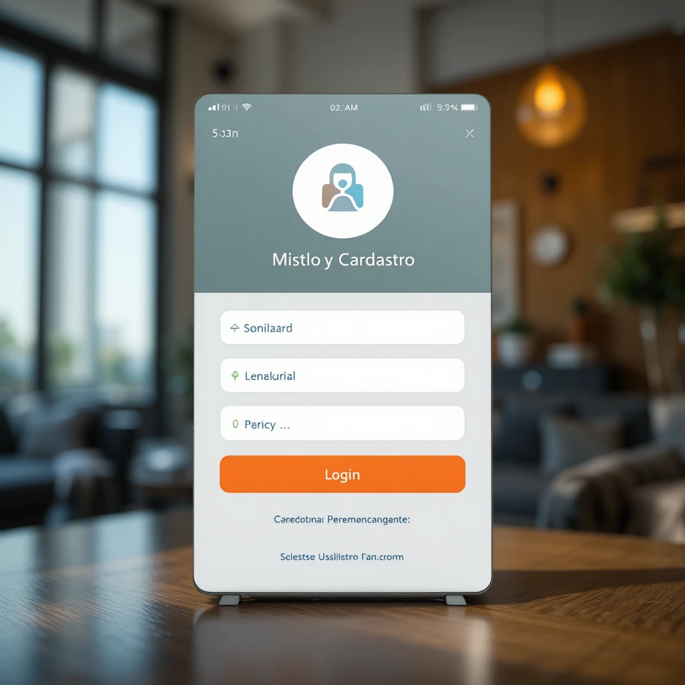

# Portfólio - Francisco Kennedy

Bem-vindo ao meu portfólio! Aqui você encontrará informações sobre mim, minhas habilidades, interesses e projetos desenvolvidos.  

---

## Sobre Mim

Olá! Sou **Francisco Kennedy**, apaixonado por **desenvolvimento web** e **design de interfaces**. Meu objetivo é transformar ideias em projetos funcionais, com foco em **experiência do usuário** e **visual moderno**.

> "Transformando linhas de código em vida."

---

## Tecnologias Aprendidas

Ao longo do meu aprendizado, adquiri conhecimento nas seguintes tecnologias:

- **HTML**  
- **CSS**  

Mais recentemente, tenho me interessado por **JavaScript** e novas ferramentas para aprimorar meus projetos.

---

## Meus Interesses

Meus interesses atuais incluem:

- Aprimorar habilidades em **HTML**
- Aprimorar habilidades em **CSS**
- Aprender cada vez mais sobre **JavaScript**  

---

## Projetos

### 1. Landing Page
  
Uma página inicial moderna e funcional.

### 2. Mini Sistema de Login
  
Um sistema simples de login com validação básica.

### 3. Mini Loja
  
Uma pequena loja online com layout interativo.

---

## Contato

Você pode me encontrar nas seguintes plataformas:

- 📩 E-mail: [eokennedylima@gmail.com](mailto:eokennedylima@gmail.com)  
- 💻 GitHub: [github.com/seuusuario](https://github.com/seuusuario)  
- 🔗 LinkedIn: [linkedin.com/in/seuusuario](https://www.linkedin.com/in/seuusuario)

---

## Redes Sociais

Siga-me nas redes sociais para acompanhar meus projetos e atualizações:

- [GitHub](https://github.com/seuusuario)  
- [LinkedIn](https://www.linkedin.com/in/seuusuario)  
- [Instagram](https://instagram.com/seuusuario)

---

© 2025 - Francisco Kennedy. Todos os direitos reservados.
